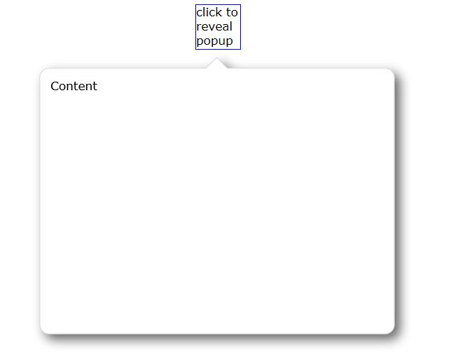
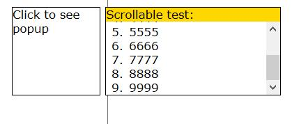
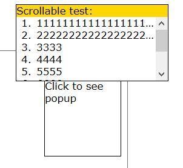
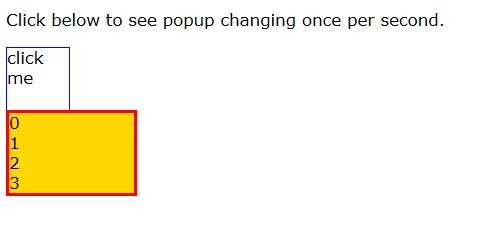
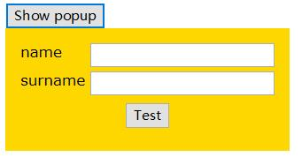
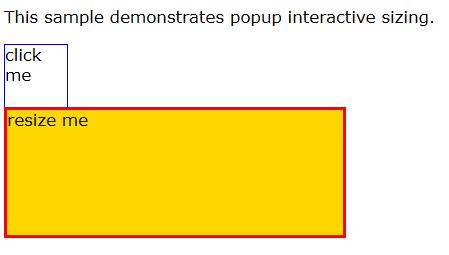
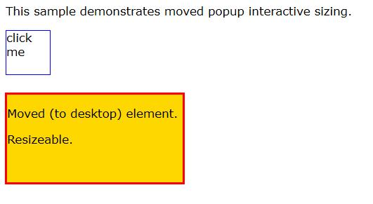
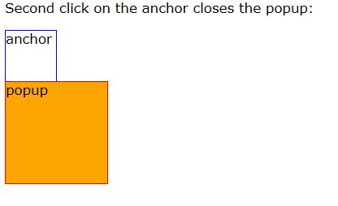
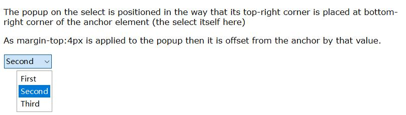
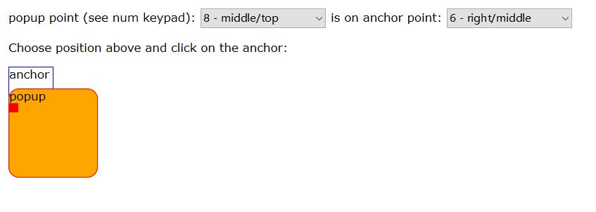

# popup弹窗

## callout-bubble

  <ClientOnly>
    <demo-block>

    
    

    
<code>
    &lt;html&gt; 
&lt;head&gt; 
  &lt;style&gt; 
    popup.bubble 
    { 
      prototype: BubblePopup; 
      background-color: transparent; // must be exactly transparent to create transparent window  
      width:400dip; 
      height:300dip; 
      cursor:pointer; 
      padding:18dip; // room for the shadow  
      cursor: default; 
      margin:2dip; // offset from anchor element 
      border:1dip solid #ddd; 
      var(shape-color): #fff; // shape background color 
    } 
    popup.bubble &gt; .content { 
      padding:12dip; 
      size:*; 
    } 
    div#anchor 
    { 
      border:1dip solid blue; 
      width:50dip; 
      height:50dip; 
      cursor:pointer; 
    } 
  &lt;/style&gt;   
  &lt;style #actions&gt; 
    div#anchor 
    { 
      behavior: button;  
      margin:0 *; 
    } 
  &lt;/style&gt;     
  &lt;script type="text/tiscript"&gt; 
      $(div#anchor) &lt;&lt; event click 
      { 
        this.popup( $(popup.bubble), (8 /*popup middle-top*/ &lt;&lt; 16) | 2 /*at anchor's middle-bottom*/); 
      }  
      class BubblePopup: Element { 
        const RADIUS = 10dip; 
        const ARROW_HEIGHT = 12dip; 
        function attached() {  
          this.paintBackground = this.drawBackground; 
        } 
        function getShape() 
        { 
          var shape = this.shape; 
          if(!shape)  
          { 
            shape = this.shape = new Graphics.Path(); 
            this.shapeWidth = null; 
            this.shapeHeight = null; 
          } 
          var (x,y,w,h) = this.$(div.content).box(#rectw,#border,#parent); 
          if( this.shapeWidth == w && this.shapeHeight == h) 
            return shape; // nothing to do already calculated 
          shape.reset(); 
          const borderWidth = this.style#border-top-width;           
          const stoke_width = this.toPixels(borderWidth,#width); 
          // lines shall go through pixels middles: 
          x += stoke_width / 2; y -= stoke_width / 2; w -= stoke_width; h -= stoke_width; 
          const r = this.toPixels(RADIUS,#width); 
          const ah = this.toPixels(ARROW_HEIGHT,#height); 
          shape           
            .moveTo(x+r, y) 
            // that arrow 
            .lineTo(x+w/2-ah,y)  
            .lineTo(x+w/2,y-ah) 
            .lineTo(x+w/2+ah,y) 
            // round rect 
            .arcTo(x+w, y,   x+w, y+h, r) 
            .arcTo(x+w, y+h, x,   y+h, r) 
            .arcTo(x,   y+h, x,   y,   r) 
            .arcTo(x,   y,   x+w, y,   r)               
            .close(); 
          return shape;  
        }       
        function drawBackground( gfx ) { 
          if(var shape = this.getShape()) { 
            const filter = [#drop-shadow: 6dip, 6dip, 6dip, rgba(0,0,0,0.60)]; // CSS: drop-sahdow(...); 
            const backColor = this.style.variable("shape-color"); 
            const hasBorder = this.style#border-top-style == "solid"; 
             gfx.pushLayer(#margin-box,filter); 
            if( hasBorder ) { 
              const borderColor = this.style#border-top-color; 
              const borderWidth = this.style#border-top-width; 
              gfx.lineWidth(borderWidth) 
                 .lineColor(borderColor) 
                 .fillColor(backColor) 
                 .drawPath( shape ); 
            } else  
              gfx.fillColor(backColor) 
                 .drawPath( shape ); 
            gfx.popLayer(); 
            return true; 
          } 
        } 
      } 
    &lt;/script&gt; 
&lt;/head&gt; 
&lt;body&gt; 
   &lt;p&gt;HTML/CSS popup with custom shape&lt;/p&gt; 
   &lt;div#anchor&gt;  
      click to reveal popup 
   &lt;/div&gt; 
    &lt;popup .bubble&gt; 
      &lt;div.content&gt;Content&lt;/div&gt; 
    &lt;/popup&gt; 
&lt;/body&gt; 
&lt;/html&gt; 
    </code>
</demo-block>
    </ClientOnly>
  

## popup-at

  <ClientOnly>
    <demo-block>

    
    

    
<code>
    &lt;html&gt; 
  &lt;head&gt; 
    &lt;title&gt;&lt;/title&gt; 
    &lt;style&gt; 
      div#test  
      {  
        behavior:button; 
        size:100dip;  
        border:1dip solid;  
        margin-left:*;  
      } 
      #test &gt; popup { background:gold; size:200dip 100dip; border: 1dip solid; margin:0 6dip; } 
      #test &gt; popup &gt; ol { overflow-y:auto; height:*; background:white; margin:0; } 
      #test &gt; popup &gt; ol &gt; li {  
        overflow-x:hidden; 
        text-overflow:ellipsis; 
        white-space:nowrap; } 
    &lt;/style&gt; 
    &lt;script type="text/tiscript"&gt; 
      $(div#test) &lt;&lt; event click 
      { 
        this.popup(this.$(popup),0x19 /*on the right/top, otherwise left/top */); 
      }  
    &lt;/script&gt; 
  &lt;/head&gt; 
&lt;body&gt; 
  &lt;div #test&gt; 
    Click to see popup 
    &lt;popup&gt; 
      Scrollable test: 
      &lt;ol&gt;  
        &lt;li&gt;111111111111111111111111111111111111&lt;/li&gt; 
        &lt;li&gt;2222222222222222222222222222222222222222&lt;/li&gt; 
        &lt;li&gt;3333&lt;/li&gt; 
        &lt;li&gt;4444&lt;/li&gt; 
        &lt;li&gt;5555&lt;/li&gt; 
        &lt;li&gt;6666&lt;/li&gt; 
        &lt;li&gt;7777&lt;/li&gt; 
        &lt;li&gt;8888&lt;/li&gt; 
        &lt;li&gt;9999&lt;/li&gt; 
      &lt;/ol&gt; 
    &lt;/popup&gt; 
  &lt;/div&gt; 
&lt;/body&gt; 
&lt;/html&gt; 
    </code>
</demo-block>
    </ClientOnly>
  

## popup-at-coordinates

  <ClientOnly>
    <demo-block>

    
    

    
<code>
&lt;html&gt; 
  &lt;head&gt; 
    &lt;title&gt;&lt;/title&gt; 
    &lt;style&gt; 
      div#test  
      {  
        behavior:button; 
        size:100dip;  
        border:1dip solid;  
        margin-left:*;  
      } 
      #test &gt; popup { background:gold; size:200dip 100dip; border: 1dip solid; margin:0 6dip; } 
      #test &gt; popup &gt; ol { overflow-y:auto; height:*; background:white; margin:0; } 
      #test &gt; popup &gt; ol &gt; li {  
        overflow-x:hidden; 
        text-overflow:ellipsis; 
        white-space:nowrap; } 
    &lt;/style&gt; 
    &lt;script type="text/tiscript"&gt; 
      $(div#test) &lt;&lt; event mousedown (evt) 
      { 
        self.popup(this.$(popup),2 /*bottom/center of popup is at:*/, evt.xView, evt.yView ); 
      }  
    &lt;/script&gt; 
  &lt;/head&gt; 
&lt;body&gt; 
  &lt;div #test&gt; 
    Click to see popup 
    &lt;popup&gt; 
      Scrollable test: 
      &lt;ol&gt;  
        &lt;li&gt;111111111111111111111111111111111111&lt;/li&gt; 
        &lt;li&gt;2222222222222222222222222222222222222222&lt;/li&gt; 
        &lt;li&gt;3333&lt;/li&gt; 
        &lt;li&gt;4444&lt;/li&gt; 
        &lt;li&gt;5555&lt;/li&gt; 
        &lt;li&gt;6666&lt;/li&gt; 
        &lt;li&gt;7777&lt;/li&gt; 
        &lt;li&gt;8888&lt;/li&gt; 
        &lt;li&gt;9999&lt;/li&gt; 
      &lt;/ol&gt; 
    &lt;/popup&gt; 
  &lt;/div&gt; 
&lt;/body&gt; 
&lt;/html&gt; 
    </code>
</demo-block>
    </ClientOnly>
  

## popup-dynamic-sizing

  <ClientOnly>
    <demo-block>

    
    

    
<code>
    &lt;html&gt; 
&lt;head&gt; 
  &lt;style&gt; 
    @import url(../+plus/plus.css); 
    popup#test 
    { 
      background-color: gold; 
      border:2dip solid red; 
      width:100dip; 
      height:auto; 
    } 
    div#anchor 
    { 
      border:1dip solid blue; 
      width:50dip; 
      height:50dip; 
      cursor:pointer; 
    } 
  &lt;/style&gt;   
  &lt;style #actions&gt; 
    div#anchor 
    { 
      behavior: button;  
    } 
  &lt;/style&gt;     
  &lt;script type="text/tiscript"&gt; 
      // NOTE: this demo uses Plus bound Demo.list  
      namespace Demo  
      { 
        var list = ["item"]; 
        function showPopup(anchor)  
        { 
          var anchorPoint = 1; // left/bottom 
          var popupPoint = 7;  // left/top 
          anchor.popup( $(popup#test), (popupPoint &lt;&lt; 16) | anchorPoint); 
        } 
        function addListItem() {  
          if( list.length &gt; 10 )  
            touchList = removeListItem;  
          else  
            list.push("new item"); 
        } 
        function removeListItem() {  
          if( list.length &lt;= 1 )  
            touchList = addListItem;  
          else  
            list.pop(); 
        } 
        var touchList = addListItem; 
      }         
      self.timer(1s, function() { Demo.touchList(); return true; } );     
    &lt;/script&gt; 
&lt;/head&gt; 
&lt;body model="Demo"&gt; 
    &lt;p&gt;This sample demonstrates automatic/dynamic popup sizing when its content changes and height:auto is set.&lt;/p&gt; 
    &lt;p&gt;Click below to see popup changing once per second.&lt;/p&gt; 
    &lt;div#anchor click="showPopup(this)"&gt;click me&lt;/div&gt; 
    &lt;popup#test each="i,item in list"&gt; 
      &lt;div&gt;&lt;(i)&gt; - &lt;(item)&gt;&lt;/div&gt; 
    &lt;/popup&gt; 
&lt;/body&gt; 
&lt;/html&gt; 
    </code>
</demo-block>
    </ClientOnly>

## popup-form

  <ClientOnly>
    <demo-block>

    
    

    
<code>
    &lt;html&gt; 
  &lt;head&gt; 
    &lt;title&gt;&lt;/title&gt; 
    &lt;style&gt; 
      popup { padding:1em; background:gold; } 
      popup &gt; button { display: block; margin:0.5em *;  } 
      popup &gt; form { flow:row(label,input); border-spacing: 4dip; } 
    &lt;/style&gt; 
    &lt;script type="text/tiscript"&gt; 
      $(#show) &lt;&lt; event click {  
        this.popup( $(popup#test)); 
      } 
    &lt;/script&gt; 
    &lt;popup #test&gt; 
      &lt;form&gt; 
        &lt;label&gt;name&lt;/label&gt;&lt;input type=text&gt; 
        &lt;label&gt;surname&lt;/label&gt;&lt;input type=text&gt; 
      &lt;/form&gt; 
      &lt;button&gt;Test&lt;/button&gt; 
    &lt;/popup&gt; 
  &lt;/head&gt; 
&lt;body&gt; 
  &lt;button #show&gt;Show popup&lt;/button&gt; 
&lt;/body&gt; 
&lt;/html&gt; 
    </code>
</demo-block>
    </ClientOnly>
  

## popup-resizing

  <ClientOnly>
    <demo-block>

    
    

    
<code>
    &&lt;html&gt; 
&lt;head&gt; 
  &lt;style&gt; 
    @import url(../../widgets/resizeable/resizeable.css); 
    popup#test 
    { 
      background-color: gold; 
      border:2dip solid red; 
      width:100dip; 
      height:100dip; 
      cursor:pointer; 
    } 
    popup#test.mouse-on-corner { 
      cursor:se-resize; 
    } 
    div#anchor 
    { 
      border:1dip solid blue; 
      width:50dip; 
      height:50dip; 
      cursor:pointer; 
    } 
  &lt;/style&gt;   
  &lt;style #actions&gt; 
    div#anchor 
    { 
      behavior: button;  
    } 
  &lt;/style&gt;     
  &lt;script type="text/tiscript"&gt; 
      $(div#anchor) &lt;&lt; event click 
      { 
        var anchorPoint = 1; // left/bottom 
        var popupPoint = 7;  // left/top 
        this.popup( $(popup#test), (popupPoint &lt;&lt; 16) | anchorPoint); 
      }  
    &lt;/script&gt; 
&lt;/head&gt; 
&lt;body&gt; 
    &lt;p&gt;This sample demonstrates popup interactive sizing.&lt;/p&gt; 
    &lt;div#anchor&gt;  
      click me 
    &lt;/div&gt; 
    &lt;popup#test resizeable &gt; 
      resize me 
    &lt;/popup&gt; 
&lt;/body&gt; 
&lt;/html&gt;
    </code>
</demo-block>
    </ClientOnly>
  

## popup-resizing-moved

  <ClientOnly>
    <demo-block>

    
    

    
<code>
    &lt;html&gt; 
&lt;head&gt; 
  &lt;style&gt; 
    @import url(../../widgets/resizeable/resizeable.css); 
    popup#test 
    { 
      background-color: gold; 
      border:2dip solid red; 
      width:200dip; 
      height:100dip; 
      cursor:pointer; 
    } 
    popup#test.mouse-on-corner { 
      cursor:se-resize; 
    }   
    div#anchor 
    { 
      border:1dip solid blue; 
      width:50dip; 
      height:50dip; 
      cursor:pointer; 
    } 
  &lt;/style&gt;   
  &lt;style #actions&gt; 
    div#anchor 
    { 
      behavior: button;  
    } 
  &lt;/style&gt;     
  &lt;script type="text/tiscript"&gt; 
      $(div#anchor) &lt;&lt; event click  
      { 
        $(popup#test).move( 400, 400, #view, #detached-window ); 
      }  
    &lt;/script&gt; 
&lt;/head&gt; 
&lt;body&gt; 
    &lt;p&gt;This sample demonstrates moved popup interactive sizing.&lt;/p&gt; 
    &lt;div#anchor&gt;  
      click me 
    &lt;/div&gt; 
    &lt;popup#test resizeable &gt; 
      &lt;p&gt;Moved (to desktop) element.&lt;/p&gt; 
      &lt;p&gt;Resizeable.&lt;/p&gt; 
    &lt;/popup&gt; 
&lt;/body&gt; 
&lt;/html&gt; 
    </code>
</demo-block>
    </ClientOnly>
  

## popup-trigger

  <ClientOnly>
    <demo-block>

    
    

    
<code>
    &lt;html&gt; 
&lt;head&gt; 
  &lt;style&gt; 
    popup#test 
    { 
      background-color: orange; 
      border:1dip solid red; 
      width:100dip; 
      height:100dip; 
      cursor:pointer; 
    } 
    div#anchor 
    { 
      behavior: button;     
      border:1dip solid blue; 
      width:50dip; 
      height:50dip; 
      cursor:pointer; 
      aspect: PopupTrigger; 
    } 
  &lt;/style&gt;   
  &lt;style #actions&gt; 
    div#anchor 
    { 
      behavior: button;  
    } 
  &lt;/style&gt;     
  &lt;script type="text/tiscript"&gt; 
    function PopupTrigger() { 
      var popup; 
      if( var popupSelector = this.attributes["popup"] ) 
        popup = self.select(popupSelector); 
      if( !popup ) 
        popup = this.select("popup"); 
      assert popup : "PopupTrigger: popup not found"; 
      var popupShown = false; 
      var me = this; 
      this &lt;&lt; event click (evt) { 
        if( !evt.target.belongsTo(this,false,true) ) 
          return false; 
        if(popupShown) 
          popup.state.popup = false; 
        else 
          this.popup(popup); 
      } 
      popup &lt;&lt; event popupready { popupShown = true; } 
            &lt;&lt; event popupdismissing { me.timer(500ms, ::popupShown = false); }; 
    }  
    &lt;/script&gt; 
&lt;/head&gt; 
&lt;body&gt; 
   &lt;p&gt;Second click on the anchor closes the popup:&lt;/p&gt; 
    &lt;div#anchor popup="#test" title="hello"&gt;  
      anchor 
    &lt;/div&gt; 
    &lt;popup #test&gt; 
      popup 
    &lt;/popup&gt; 
&lt;/body&gt; 
&lt;/html&gt; 
    </code>
</demo-block>
    </ClientOnly>

## select-popup-positioning

  <ClientOnly>
    <demo-block>

    
    

    
<code>
    &lt;html&gt; 
  &lt;head&gt; 
    &lt;title&gt;&lt;/title&gt; 
    &lt;style&gt; 
      select &gt; popup {  
        width:max-content; 
        popup-position: top-right bottom-right; /*point-on-popup at point-on-anchor */ 
        margin-top:4px; 
      } 
      select &gt; popup &gt; option { 
        padding: 2px 4px; 
      } 
    &lt;/style&gt; 
  &lt;/head&gt; 
&lt;body&gt; 
  &lt;p&gt;The popup on the select is positioned in the way that its top-right corner is placed at bottom-right corner 
  of the anchor element (the select itself here)&lt;/p&gt; 
  &lt;p&gt;As margin-top:4px is applied to the popup then it is offset from the anchor by that value.&lt;/p&gt;   
  &lt;select&gt; 
    &lt;option&gt;First&lt;/option&gt; 
    &lt;option&gt;Second&lt;/option&gt; 
    &lt;option&gt;Third&lt;/option&gt; 
  &lt;/select&gt; 
&lt;/body&gt; 
&lt;/html&gt; 
    </code>
</demo-block>
    </ClientOnly>
  

## show-popup

  <ClientOnly>
    <demo-block>

    
    

    
<code>
    &lt;html&gt; 
&lt;head&gt; 
  &lt;style&gt; 
    popup#test 
    { 
      background-color: orange; 
      border:1dip solid red; 
      width:100dip; 
      height:100dip; 
      cursor:pointer; 
      border-radius: 12dip;  
    } 
    div#anchor 
    { 
      border:1px solid blue; 
      width:50dip; 
      height:50dip; 
      cursor:pointer; 
    } 
    popup#test &gt; div { 
      background:red; size:10dip; 
    } 
    popup#test &gt; div:hover { 
      background:blue; 
    } 
  &lt;/style&gt;   
  &lt;style #actions&gt; 
    div#anchor 
    { 
      behavior: button;  
    } 
  &lt;/style&gt;     
  &lt;script type="text/tiscript"&gt; 
      $(div#anchor) &lt;&lt; event mousedown 
      { 
        if(!this.state.ownspopup) { 
          var anchorPoint = $(select#anchor-point).value; 
          var popupPoint = $(select#popup-point).value; 
          this.popup( $(popup#test), (popupPoint &lt;&lt; 16) | anchorPoint); 
        } 
      }  
      // close popup on mouseup inside it 
      event ~mouseup $(popup) { 
        this.state.popup = false; 
      } 
    &lt;/script&gt; 
&lt;/head&gt; 
&lt;body&gt; 
   popup point (see num keypad): 
   &lt;select #popup-point&gt; 
     &lt;option value=1&gt;1 - left/bottom&lt;/option&gt;    
     &lt;option value=2&gt;2 - middle/bottom&lt;/option&gt;    
     &lt;option value=3&gt;3 - right/bottom&lt;/option&gt;    
     &lt;option value=4&gt;4 - left/middle&lt;/option&gt;    
     &lt;option value=5&gt;5 - middle/middle&lt;/option&gt;    
     &lt;option value=6&gt;6 - right/middle&lt;/option&gt;    
     &lt;option value=7&gt;7 - left/top&lt;/option&gt;    
     &lt;option value=8 selected&gt;8 - middle/top&lt;/option&gt;    
     &lt;option value=9&gt;9 - right/top&lt;/option&gt;    
   &lt;/select&gt; is on anchor point: 
   &lt;select #anchor-point&gt; 
     &lt;option value=1&gt;1 - left/bottom&lt;/option&gt;    
     &lt;option value=2 selected&gt;2 - middle/bottom&lt;/option&gt;    
     &lt;option value=3&gt;3 - right/bottom&lt;/option&gt;    
     &lt;option value=4&gt;4 - left/middle&lt;/option&gt;    
     &lt;option value=5&gt;5 - middle/middle&lt;/option&gt;    
     &lt;option value=6&gt;6 - right/middle&lt;/option&gt;    
     &lt;option value=7&gt;7 - left/top&lt;/option&gt;    
     &lt;option value=8&gt;8 - middle/top&lt;/option&gt;    
     &lt;option value=9&gt;9 - right/top&lt;/option&gt;    
   &lt;/select&gt; 
   &lt;p&gt;Choose position above and click on the anchor:&lt;/p&gt; 
    &lt;div#anchor&gt;  
      anchor 
    &lt;/div&gt; 
    &lt;popup #test&gt; 
      popup 
      &lt;div&gt;&lt;/div&gt; 
    &lt;/popup&gt; 
&lt;/body&gt; 
&lt;/html&gt; 
    </code>
</demo-block>
    </ClientOnly>
  
